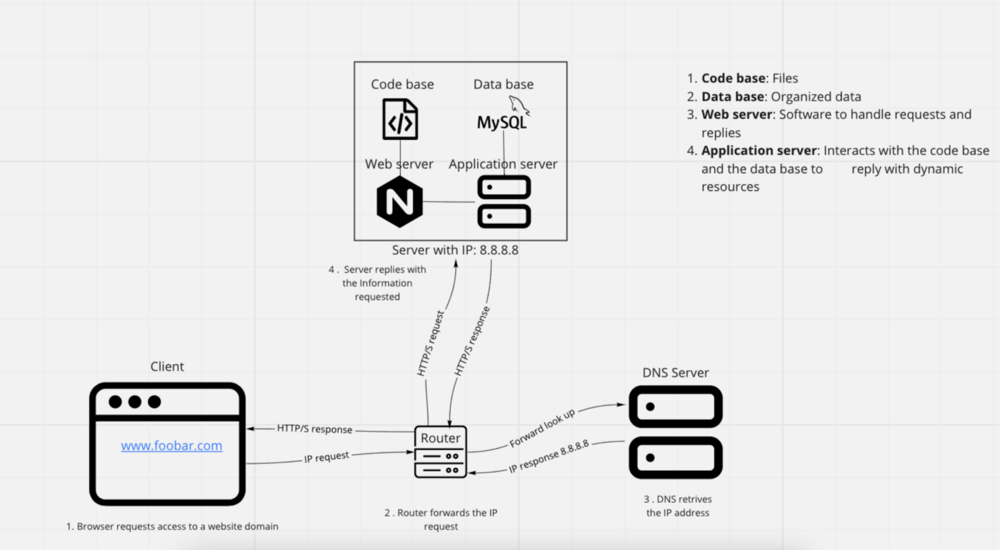
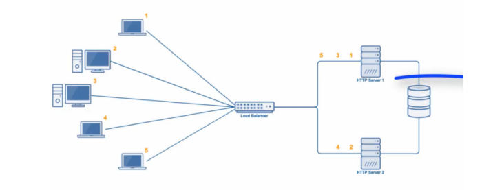
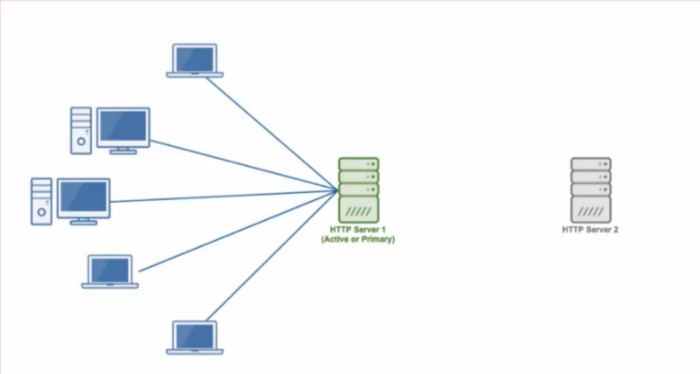
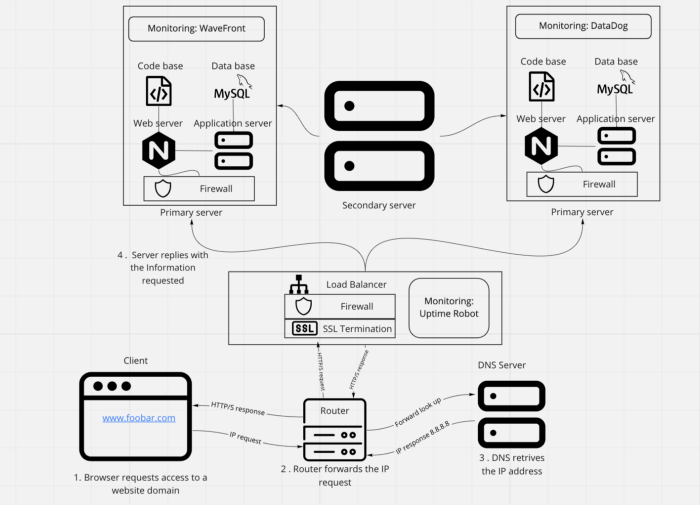
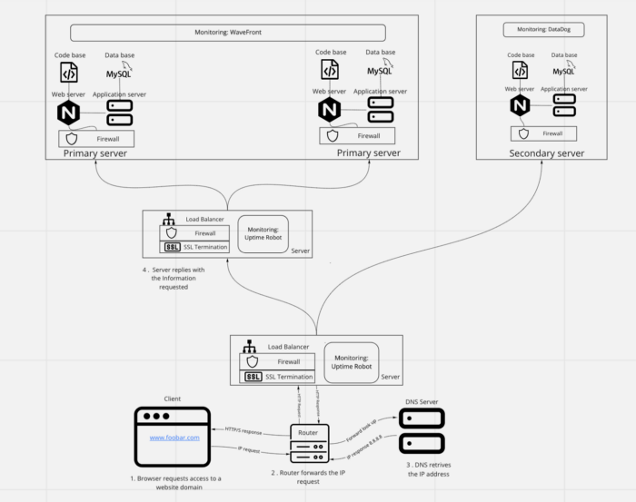

<html><head><meta content="text/html; charset=UTF-8" http-equiv="content-type"></head><body class="c9 c19 doc-content">
Based on &gt;<a class="c10" href="https://www.google.com/url?q=https://oa-angel26.medium.com/web-infrastructure-design-4634a2e1b27c&amp;sa=D&amp;source=editors&amp;ust=1657932264054050&amp;usg=AOvVaw2cJz5rRody0Ma5NEXfQuix">https://oa-angel26.medium.com/web-infrastructure-design-4634a2e1b27c</a>

<h1 class="c9 c12" id="h.lxccwcbfbdip">Web infrastructure design</h1><h1 class="c12 c9" id="h.f7lozvhs01va">0. Simple Web Stack</h1>

<ul class="c25 lst-kix_datwu4duz7iu-0 start"><li class="c5 li-bullet-0">What is a server</li></ul>
Servers are physical machines (as hardwares), virtual machines or softwares (computer programs) that serve or provide functionality to other programs or devices called &ldquo;clients&rdquo;. The term server comes from queuing theory used in Kendall&rsquo;s notation, where servers serve or process the clients requirements in the same way as a telephone operator, a cooker or a production machine process incoming orders, having in mind its capacity and service process time.

A computer can function as a server, and a server can be a computer, both of them being built up with hardware and software. However, the main difference between these two is the capacity and computer power servers have. In other words, servers are computers on steroids with faster processing capacity. They are usually stored in data centers racks (stacks of servers piled one on top of each other).

On the other hand, virtual servers function more like virtual machines, or virtual computers. These are a virtual representation of the physical servers, having their own operating system and applications (Posey, 2021).

(ejemplo de tipos de servers softwares) (tipos de servicios que ofrecen los servidores
<ul class="c25 lst-kix_nvmumto13an9-0 start"><li class="c5 li-bullet-0">What is the role of the domain name</li></ul>
The role of the domain name is to replace complex IP addresses numbers into easily understandable names so humans can remember and communicate them in a better way.
<ul class="c25 lst-kix_f5trophtdthk-0 start"><li class="c5 li-bullet-0">What type of DNS record www is in <a class="c10" href="https://www.google.com/url?q=http://www.foobar.com/&amp;sa=D&amp;source=editors&amp;ust=1657932264056426&amp;usg=AOvVaw2v6G9bGGbP36DmEbjYDzCs">www.foobar.com</a></li></ul>
DNS record of www belongs to a subdomain of the <a class="c10" href="https://www.google.com/url?q=http://www.foobar.com/&amp;sa=D&amp;source=editors&amp;ust=1657932264056870&amp;usg=AOvVaw2JEqpVFf5Rg0aUs_WmFReE">www.foobar.com</a>
<ul class="c25 lst-kix_luccqdegnkcc-0 start"><li class="c5 li-bullet-0">What is the role of the web server</li></ul>
Web servers are what make Web hosting possible, that is, the possibility of renting a space on a server to store the files of our site.

The fundamental role of a Web Server

The main function of a Web server is to store the files of a site and broadcast them over the Internet so that they can be visited by users. Basically, a web server is a large computer that stores and transmits data via the network system called the Internet. When a user enters an Internet page, his browser communicates with the server sending and receiving data that determines what he sees on the screen. Therefore, we say that Web servers are to store and transmit data from a site as requested by a visitor&rsquo;s browser.
<ul class="c25 lst-kix_z7cbnx6pmjh-0 start"><li class="c5 li-bullet-0">What is the role of the application server</li></ul>
The application server is the intermediary between browser-based databases and back-end databases and legacy systems. In many uses, the application server combines or works with a web server (Hypertext Transfer Protocol) and is called a web application server.
<ul class="c25 lst-kix_t6k5yjk54lu0-0 start"><li class="c5 li-bullet-0">What is the role of the database</li></ul>
The role of the database is to make the information gathered organized so it can be easily accessed, managed and updated. However, not all database management systems work the same, and the mechanisms they use to organize data can vary, ranging from relational and object-oriented databases, to distributed or cloud database models. Next, some of its main differences:

Relational databases:

Are composed of a set of tables where data is organized into a predefined category. Each table has at least one data category in a column, and each row represents an instance of the categories defined in the columns. SQL (The Structured Query Language) is a popular example of a relational database.

Distributed database:

Distributed database system consists of portions of a database that can be heterogeneous or homogeneous distributed along multiple physical locations.

Cloud database:

Cloud database is a database built in a virtual environment, just as in a hybrid cloud, public cloud or private cloud. Scalability on demand, and high availability are one of the benefits of having a cloud database.

NoSQL database:

Are useful for big data performance and large sets of distributed data, specially when the need of analyzing large sets of unstructured data stored across multiple virtual servers in the cloud.

Object-oriented database:

Another example is an object-oriented database which is organized around objects instead of actions (Hughes, 2019).
<ul class="c25 lst-kix_pe97u9huhgu-0 start"><li class="c5 li-bullet-0">What is the server using to communicate with the computer of the user requesting the website</li></ul>
The server is using the HTTP (Hypertext Transfer Protocol), which enables the transfer of resource and data, such as HTML documents between the server and the client. In this data exchange, requests initiated by the client, which are done normally by the web browser (they can also be done by an operating system or application), are called requests and server answers are called responses. Between the client and server data exchange, we can find numerous entities - collectively called proxies, - performing different operations such as gateways or caches.

From the client side, the browser is the one who always initiates the request to the server of data such as HTML and CSS files. Never the other way around. Once the request is received by the server, this serves the documents as requested by the client, so it can finally present the Web Page. (Mozzila.org)
<h2 class="c0" id="h.p36nqod3m2y5">Issues with the simple web infrastructure</h2><ul class="c25 lst-kix_hn91amg94uyt-0 start"><li class="c9 c24 li-bullet-0">One of the issues of having a simple web infrastructure, has to do with the SPOF (Single Point of Failure) where if a component of the system fails, there is no backup supporting continuity, bringing the whole system to a collapse.</li><li class="c28 c9 li-bullet-0">Also, whenever some structure or node in the system needs to be repaired, the whole system has to be shut down, while the maintenance is done. Then, client requests cannot be attended during this period of time.</li><li class="c9 c28 li-bullet-0">Overload of traffic can be a risk to server capacity and the ability to scale restrained since there are no other additional servers as backup. Leading to a possible breakdown of the web page and unattended client requests as traffic surpasess servers capacity.</li></ul>

<h1 class="c20 c9" id="h.q2fweko49wr7">1. Distributed Web Infrastructure</h1>

Additional elements, why are you adding them?

The new configuration is composed of two master-servers and one slave-server. As master-servers will work on an Active-Active setup, their configuration must be identical, therefore we need to replicate every element we had in the simple web infrastructure configuration explained above. The load is going to be managed through a load-balancer (reverse proxy), which distributes the queries according to a Robin-Round algorithm. Finally an additional server will be needed to serve a replica or slave server, helping either to unload or simply avoid overloaded masters servers.

What distribution algorithm your load balancer is configured with and how it works

Our load-balancer is using a Round Robin algorithm distribution. Meaning the queries requested are distributed to every server sequentially. This will lead to a server load distribution of 50% on each of the two servers configuration.

Is your load-balancer enabling an Active-Active or Active-Passive setup? Explain the difference between both.

Our load-balancer is enabling an Active-Active set up.

The Active-Active cluster is typically made up of at least two nodes, both activaley running the same type of services at the same time. Their purpose is to achieve load balancing by distributing tasks to different servers in order to prevent overload. As there are more than one server (nodes) available to severe, the service time and process throughput can have improvements.

On the other hand the Active-Passive setup, also made up of at least two nodes (servers), however not all nodes are going to be active simultaneously. In this configuration, while one node is active, the other nodes (failover servers) are passively waiting to be active as backup in case the primary server (the one being in use actively) is disconnected or unable to serve. Under this configuration, and as in the Active-Active set up, it is important that primary and failover nodes have the exact server configuration, so clients won&rsquo;t be able to tell the difference when the failover server takes over the operation (Villanueva, 2017).

How a database Primary-Replica (Master-Slave) cluster works

A database Primary-Replica (Master-Replica) is a mechanism which enables data of one database server (the master) to be replicated or to be copied to one or more computers or database servers (the slaves), in order all users share the same level of information. This process leads to a distributed database in which users can quickly access data without interfering with each other.

The database replication process can either be synchronous or asynchronous. In the first one, the replication process is done from the client server to the model server and then replicated to all the replica servers before the client is notified about the data replication. This method of replication may take longer to verify, however all data was copied before proceeding.

As in the asynchronous replication process, replication is done by sending data from the client to the model server, followed by a confirmation order to the client, who finally gives permission of copying to the replicas at an unspecified or monitored pace (Lutkevich, 2020)

What is the difference between the primary node and the replica node in regard to the application.

One of the main differences between the primary node and the replica node, regarding the application, is that the primary database is regarded as the authoritative source, while the replica database is synchronized to it. The primary node serves as the keeper of information, here the &ldquo;real&rdquo; data is kept, then writing only happens here. On the other hand, reading only occurs in the replica or slave node. This architecture purpose is due to safeguard site reliability. In case a site receives a lot of traffic, a replica node prevents overloading of the master node with reading and writing requests. This eases the load of the entire system preventing it to collapse (Theodorus, 2020).
<h2 class="c0" id="h.l42wr4nu0pnu">Issues with the distributed web infrastructure</h2><h1 class="c20 c9" id="h.h3v8lq7dje4z">2. Secured and monitored web infrastructure</h1>

For every additional element, why you are adding it
<ul class="c25 lst-kix_r418vqtsqvu7-0 start"><li class="c5 li-bullet-0">3 Firewalls: The first Firewall checks the rules after receiving the requests and could deny following requests. The second firewall is working in the server to prevent someone hacking depending of the requests, and the third firewall acts as a circuit-level firewalls, inspect the transaction of the information.</li><li class="c14 c9 li-bullet-0">SSL certificate: 1 SSL certificate: is added to secure https protocols and encrypt communication. Then, the &lsquo;plain text&rsquo; won&rsquo;t be easy accessed or viewed by a third person, making the protocol communication and data transfer form the browser and web server more secure (Instant SSL, 2021)</li></ul>
What are firewalls for

Firewalls is a network security device that monitors network traffic, it can be understood as a division or &ldquo;wall&rdquo; between a private network and public network which limits and blocks network traffic based on a set of security rules in the hardware or software by analyzing data packets that request entry to the network. Additionally, firewalls are used to allow remote access to a private network through secure authentication (Beal, 1996)

Why is the traffic served over HTTPS

HTTPS stands for HyperText Transfer Protocol Secure, and the traffic is served in order to bring protection by using the secure port 443, which encrypts outgoing information. Then it is more difficult to spy or get access to the site&rsquo;s information.

What monitoring is used for

Monitoring is practice used for quality control. As Peter Ducker said, &ldquo;What can&rsquo;t be measured, it can&rsquo;t be improved&rdquo;. Then, monitoring not only helps to make sure to maintain high quality levels, keeping the established standards and consistency, but also to help in the continuous improvement of the resources performance.

The way data monitoring is performed, relies on checking new data against predefined rules and metrics. If data quality anomalies are detected, an alert is sent in order to give information about the metrics and rules violation, so data can be checked (Informatica, 2021).

3 monitoring clients: 2 monitoring deployed in each master-server, and one monitoring client for the load balancer. This will help understand the metrics of the performance of the resources according to the users requests. The information gathered will help us improve users&rsquo; experience and make decisions on the future whether to scale up the web infrastructure system.

How the monitoring tool is collecting data

IT monitoring is composed of three parts: 1) Fundation; 2) Software, and 3) Interpretation in order to function.
<ul class="c25 lst-kix_gkz04k3z2c1h-0 start"><li class="c5 li-bullet-0">Foundation:&nbsp;Are related to the infrastructure at its lowest layer of the software stack. This includes physical and virtual devices, such as servers, CPUs and VMs.</li><li class="c9 c14 li-bullet-0">Software:&nbsp;The software is the monitoring section which analyzes what is happening in the devices (physical or virtual machines) in terms of CPU usage, load, memory, and running count.</li><li class="c14 c9 li-bullet-0">Interpretation:&nbsp;Here is where collected data is turned into metrics and are presented through graphs or data charts (mostly on GUI dashboard). This is often integrated with tools of data visualization to help better understand and do data analytics of performance (Gillis, 2020).</li></ul>
Explain what to do if you want to monitor your web server QPS

Queries per second is a measure of the rate of traffic going in a particular server serving a Web domain. It is an important metric to monitor, because it can help you decide whether to scale the server in order to cope with the demand of usage, and resource requirement so the web page won&rsquo;t collapse in the future with overload server request.
<h2 class="c0" id="h.jv7mpxh9j93l">Issues with the secured and monitored web infrastructure</h2>

<h1 class="c9 c20" id="h.8lgo8l4tvje3">3. Scale up</h1>

Bibliography

Beal, V. (1996, 10 04). Firewall. Webopedia. <a class="c10" href="https://www.google.com/url?q=https://www.webopedia.com/definitions/firewall/&amp;sa=D&amp;source=editors&amp;ust=1657932264066349&amp;usg=AOvVaw2SziwGRyxazWlQDK7AaUzq">https://www.webopedia.com/definitions/firewall/</a>

Gillis, A. S. (2020, 05 01). IT monitoring. Tech Target. <a class="c10" href="https://www.google.com/url?q=https://searchitoperations.techtarget.com/definition/IT-monitoring&amp;sa=D&amp;source=editors&amp;ust=1657932264066995&amp;usg=AOvVaw3HvgN4USkAtmPIniIcQLX3">https://searchitoperations.techtarget.com/definition/IT-monitoring</a>

Hughes, A. (2019, 07 01). What is a database. TechTarget. <a class="c10" href="https://www.google.com/url?q=https://searchdatamanagement.techtarget.com/definition/database&amp;sa=D&amp;source=editors&amp;ust=1657932264067596&amp;usg=AOvVaw2lge8Z2ofKEZhNawLFXrH2">https://searchdatamanagement.techtarget.com/definition/database</a>

Informatica. (2021, 07 01). What is Data Monitoring?&nbsp;Informatica. <a class="c10" href="https://www.google.com/url?q=https://www.informatica.com/services-and-training/glossary-of-terms/data-monitoring-definition.html&amp;sa=D&amp;source=editors&amp;ust=1657932264068153&amp;usg=AOvVaw1srHueiMfBXXyu_R1j8a6G">https://www.informatica.com/services-and-training/glossary-of-terms/data-monitoring-definition.html</a>

Instant SSL. (2021, 01 01). What is HTTPS?&nbsp;Instat SSL. <a class="c10" href="https://www.google.com/url?q=https://www.instantssl.com/http-vs-https&amp;sa=D&amp;source=editors&amp;ust=1657932264068491&amp;usg=AOvVaw0_DWL7flJwdKIAi8i34ath">https://www.instantssl.com/http-vs-https</a>

Lutkevich, B. (2020, 02 01). Database Replication. Tech Targer. <a class="c10" href="https://www.google.com/url?q=https://searchdatamanagement.techtarget.com/definition/database-replication&amp;sa=D&amp;source=editors&amp;ust=1657932264068878&amp;usg=AOvVaw3mo2qssPwX3kM7ws3SBTJz">https://searchdatamanagement.techtarget.com/definition/database-replication</a>

Mozzila.org. (01, 01 2021). An overview of HTTP. MDN Web Docs. <a class="c10" href="https://www.google.com/url?q=https://developer.mozilla.org/en-US/docs/Web/HTTP/Overview&amp;sa=D&amp;source=editors&amp;ust=1657932264069278&amp;usg=AOvVaw2ItIkdLIUK5EIcy-yo6z-I">https://developer.mozilla.org/en-US/docs/Web/HTTP/Overview</a>

Posey, B. (2021, 06 01). What is a Server?&nbsp;TechTarget. <a class="c10" href="https://www.google.com/url?q=https://whatis.techtarget.com/definition/server&amp;sa=D&amp;source=editors&amp;ust=1657932264069596&amp;usg=AOvVaw3OXo9wWmUKtcRX3Y54PcsY">https://whatis.techtarget.com/definition/server</a>

Theodorus, A. (2020, 05 28). The Master-Slave Database Concept For Beginners. Data Driven Investor. <a class="c10" href="https://www.google.com/url?q=https://www.datadriveninvestor.com/2020/05/28/the-master-slave-database-concept-for-beginners/?__cf_chl_managed_tk__%3Dpmd_3912248fcb17d91e37c8d96e64a086b380b07a97-1626565463-0-gqNtZGzNAzijcnBszQei&amp;sa=D&amp;source=editors&amp;ust=1657932264070024&amp;usg=AOvVaw1M6Ic_kFMeNZSLKaYtWJaf">https://www.datadriveninvestor.com/2020/05/28/the-master-slave-database-concept-for-beginners/?__cf_chl_managed_tk__=pmd_3912248fcb17d91e37c8d96e64a086b380b07a97-1626565463-0-gqNtZGzNAzijcnBszQei</a>

Villanueva, J. C. (2017, 04 12). Active-Active vs. Active-Passive &mdash; High Availability &amp; Load Balancing. Jscape. <a class="c10" href="https://www.google.com/url?q=https://www.jscape.com/blog/video-active-active-vs-active-passive-high-availability-cluster&amp;sa=D&amp;source=editors&amp;ust=1657932264070407&amp;usg=AOvVaw1kBYIaiWBkLWzfwWFm-TcE">https://www.jscape.com/blog/video-active-active-vs-active-passive-high-availability-cluster</a>

</body></html>